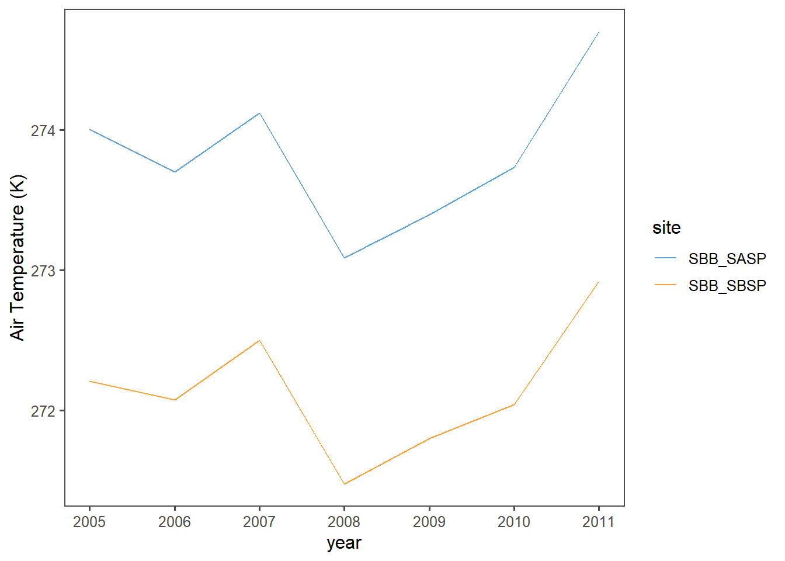
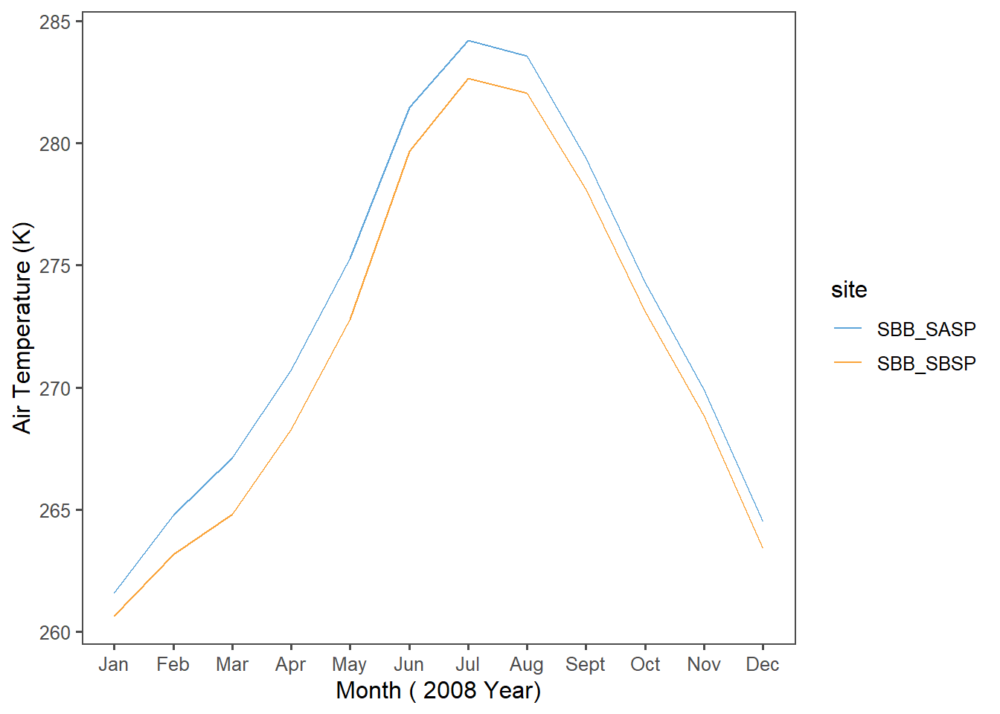
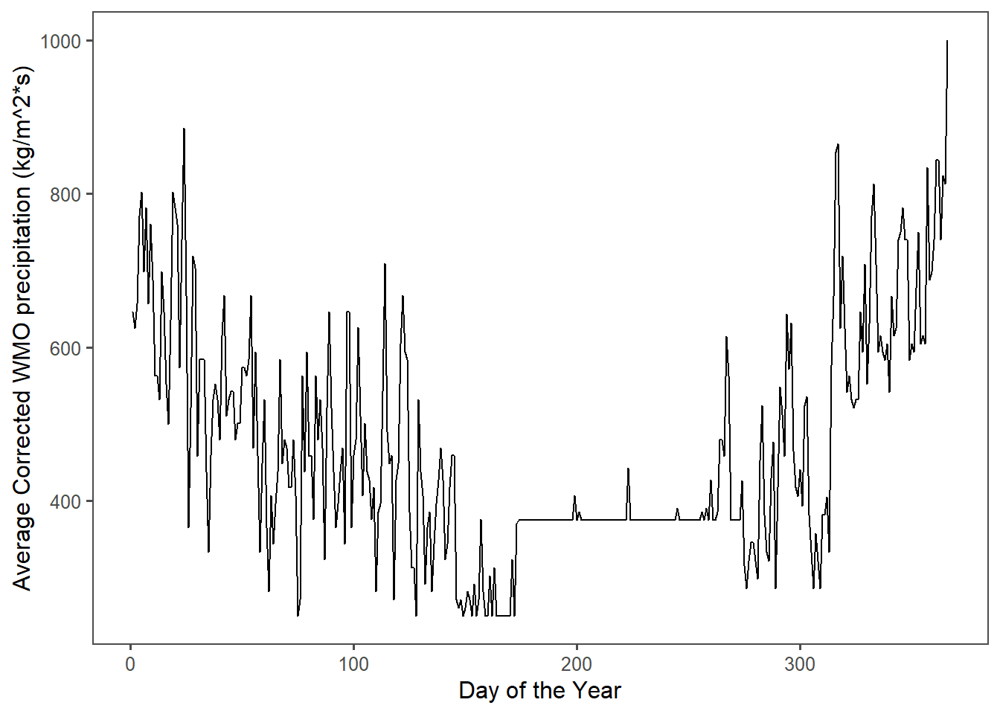
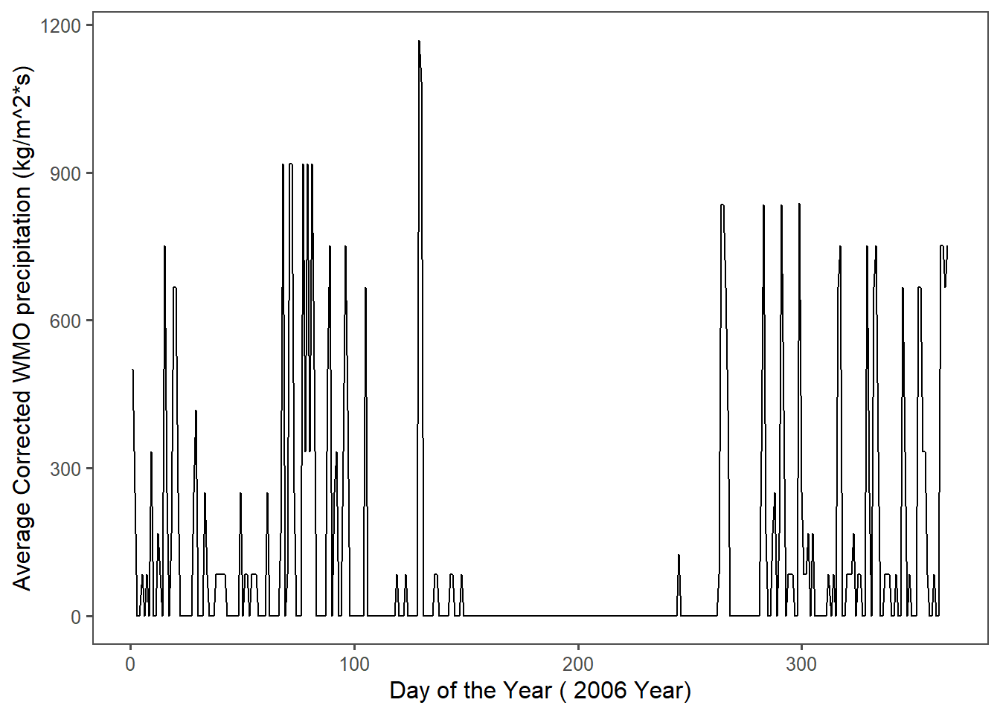
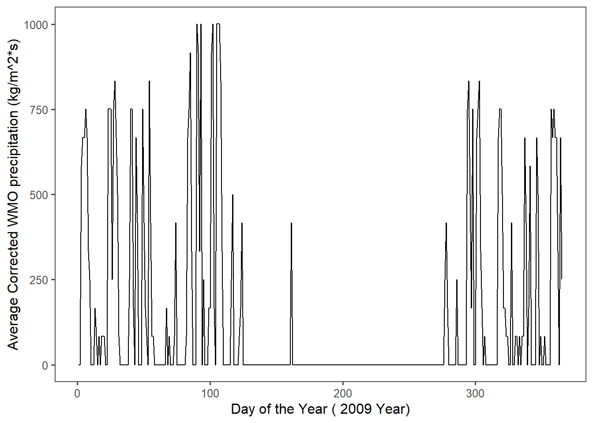

# Ieterations (Snow Functions)


**Case Study: Snowstudies.org**


## Extract the meteorological data URLs. 


```r
#Extracting only the weblinks and then the URLs! The `rvest` package is used to to get the URLs for the `SASP forcing` and `SBSP_forcing` meteorological datasets.

site_url <- 'https://snowstudies.org/archived-data/'

#Reading the web url
webpage <- read_html(site_url)

links_forcing <- webpage %>%
  html_nodes('a') %>%
  .[grepl('forcing',.)] %>%
  html_attr('href')
```

## Downloading meteorological data. 

```r
#Use of the `download_file` and `str_split_fixed` commands to download the data and save it in data folder

#Grabbing only the name of the file by splitting out on forward slashes
splits_forcing <- str_split_fixed(links_forcing,'/',8)

#Keeping only the 8th column
dataset_forcing <- splits_forcing[,8] 

#generating a file list for where the data goes
file_names_forcing <- paste0('data/',dataset_forcing)

for(i in 1:2){
  download.file(links_forcing[i],destfile=file_names_forcing[i])
}

downloaded_forcing <- file.exists(file_names_forcing)

evaluate_forcing <- !all(downloaded_forcing)
```

## Writing a custom function to read in data and append a site column to the data. 


```r
# headers from metadata pdf file

library(pdftools)
headers_forcing <- pdf_text('https://snowstudies.org/wp-content/uploads/2022/02/Serially-Complete-Metadata-text08.pdf') %>%
  readr::read_lines(.) %>%
  trimws(.) %>%
  str_split_fixed(.,'\\.',2) %>%
  .[,2] %>%
  .[1:26] %>%
  str_trim(side = "left")

#writing the function
forcing_reader <- function(file_names_forcing){
  name = str_split_fixed(file_names_forcing,'/',2)[,2] %>%
    gsub('_Forcing_Data.txt','',.)
  reading = read.delim(file_names_forcing, header = FALSE, sep ="",col.names = headers_forcing,skip = 4) %>%
  mutate(site=name)
}
```
## Using the `map` function to read in both meteorological files.


```r
forcing_data_full <- map_dfr(file_names_forcing,forcing_reader)

#tibble summary
summary(forcing_data_full)
```

```
##       year          month             day             hour           minute 
##  Min.   :2003   Min.   : 1.000   Min.   : 1.00   Min.   : 0.00   Min.   :0  
##  1st Qu.:2005   1st Qu.: 3.000   1st Qu.: 8.00   1st Qu.: 5.75   1st Qu.:0  
##  Median :2007   Median : 6.000   Median :16.00   Median :11.50   Median :0  
##  Mean   :2007   Mean   : 6.472   Mean   :15.76   Mean   :11.50   Mean   :0  
##  3rd Qu.:2009   3rd Qu.: 9.000   3rd Qu.:23.00   3rd Qu.:17.25   3rd Qu.:0  
##  Max.   :2011   Max.   :12.000   Max.   :31.00   Max.   :23.00   Max.   :0  
##                                                                             
##      second  precip..kg.m.2.s.1. sw.down..W.m.2.     lw.down..W.m.2.  
##  Min.   :0   Min.   :0.000e+00   Min.   :-9999.000   Min.   :-9999.0  
##  1st Qu.:0   1st Qu.:0.000e+00   1st Qu.:   -3.510   1st Qu.:  173.4  
##  Median :0   Median :0.000e+00   Median :   -0.344   Median :  231.4  
##  Mean   :0   Mean   :3.838e-05   Mean   :-1351.008   Mean   :-1325.7  
##  3rd Qu.:0   3rd Qu.:0.000e+00   3rd Qu.:  294.900   3rd Qu.:  272.2  
##  Max.   :0   Max.   :6.111e-03   Max.   : 1341.000   Max.   :  365.8  
##                                                                       
##   air.temp..K.   windspeed..m.s.1.   relative.humidity.... pressure..Pa.  
##  Min.   :242.1   Min.   :-9999.000   Min.   :  0.011       Min.   :63931  
##  1st Qu.:265.8   1st Qu.:    0.852   1st Qu.: 37.580       1st Qu.:63931  
##  Median :272.6   Median :    1.548   Median : 59.910       Median :65397  
##  Mean   :272.6   Mean   : -790.054   Mean   : 58.891       Mean   :65397  
##  3rd Qu.:279.7   3rd Qu.:    3.087   3rd Qu.: 81.600       3rd Qu.:66863  
##  Max.   :295.8   Max.   :  317.300   Max.   :324.800       Max.   :66863  
##                                                                           
##  specific.humidity..g.g.1. calculated.dewpoint.temperature..K.
##  Min.   :0.000000          Min.   :   0.0                     
##  1st Qu.:0.001744          1st Qu.:   0.0                     
##  Median :0.002838          Median :   0.0                     
##  Mean   :0.003372          Mean   :  74.9                     
##  3rd Qu.:0.004508          3rd Qu.:   0.0                     
##  Max.   :0.014780          Max.   :2002.0                     
##                                                               
##  precip..WMO.corrected..kg.m.2.s.1.
##  Min.   :   0.0                    
##  1st Qu.:   0.0                    
##  Median :   0.0                    
##  Mean   : 424.7                    
##  3rd Qu.:   0.0                    
##  Max.   :3002.0                    
##                                    
##  air.temp..corrected.with.Kent.et.al...1993...K.
##  Min.   :   0                                   
##  1st Qu.:   0                                   
##  Median :   0                                   
##  Mean   : 438                                   
##  3rd Qu.:   0                                   
##  Max.   :5002                                   
##                                                 
##  air.temp..corrected.with.Anderson.and.Baumgartner..1998..K.
##  Min.   :   0.0                                             
##  1st Qu.:   0.0                                             
##  Median :   0.0                                             
##  Mean   : 173.9                                             
##  3rd Qu.:   0.0                                             
##  Max.   :5002.0                                             
##                                                             
##  air.temp..corrected.with.Nakamura.and.Mahrt..2005...K.
##  Min.   :   0.0                                        
##  1st Qu.:   0.0                                        
##  Median :   0.0                                        
##  Mean   : 605.9                                        
##  3rd Qu.:   0.0                                        
##  Max.   :6002.0                                        
##                                                        
##  air.temp..corrected.with.Huwald.et.al...2009...K. qc.code.precip
##  Min.   :   0.00                                   Mode:logical  
##  1st Qu.:   0.00                                   NA's:138336   
##  Median :   0.00                                                 
##  Mean   :  56.49                                                 
##  3rd Qu.:   0.00                                                 
##  Max.   :6009.00                                                 
##  NA's   :5214                                                    
##  qc.code.sw.down qc.code.lw.down qc.code.air.temp qc.code.wind.speed
##  Mode:logical    Mode:logical    Mode:logical     Mode:logical      
##  NA's:138336     NA's:138336     NA's:138336      NA's:138336       
##                                                                     
##                                                                     
##                                                                     
##                                                                     
##                                                                     
##  qc.code.relhum     site          
##  Mode:logical   Length:138336     
##  NA's:138336    Class :character  
##                 Mode  :character  
##                                   
##                                   
##                                   
## 
```


## Line plots - mean temp by year by site.


```r
#summarizing mean temperature
forcing_yearly <- forcing_data_full %>%
  group_by(year,site) %>%
  summarize(yearly_air_temp_k = mean(air.temp..K.,na.rm=T))

#graphing data
ggplot(forcing_yearly,aes(x=year,y=yearly_air_temp_k,color=site)) + 
  geom_line() +
  scale_x_continuous(breaks = c(2003,2004,2005,2006,2007,2008,2009,2010,2011))+
  ggthemes::theme_few() + 
    ggthemes::scale_color_few() +
  ylab('Air Temperature (K)')
```


For both the SASP and SBSP sites, here is a sharp increase in air temperature between the years 2003 and 2005; this is at odds with the stable trendline from 2005 onwards. The following graph filters the years before 2005:


```r
#filtering by year 2005
forcing_yearly_filter <- forcing_yearly %>%
  filter(year >= 2005)

#graphing data
ggplot(forcing_yearly_filter,aes(x=year,y=yearly_air_temp_k,color=site)) + 
  geom_line() +
  scale_x_continuous(breaks = c(2005,2006,2007,2008,2009,2010,2011)) +
  ggthemes::theme_few() + 
  ggthemes::scale_color_few() +
  ylab('Air Temperature (K)')
```



## Writing a function for line plots of monthly average temperature at each site for a given year.
Hint: https://ggplot2.tidyverse.org/reference/print.ggplot.html

```r
#summarizing mean temperature
forcing_monthly_air_temperature <- forcing_data_full %>%
  group_by(year,month,site) %>%
  summarize(monthly_air_temp_k = mean(air.temp..K.,na.rm=T))

#creating function for graphing
temp_plot <- function(filter_year_function,year_air){
    filter_year_function <- forcing_monthly_air_temperature %>%
      group_by(year,month,site)  %>%
      filter(year==year_air)
    
    #changing text by year
    str1 = 'Month ('
    str2 = year_air
    str3 = "Year)"
    
    #plotting
    x= ggplot(filter_year_function, aes(x=month,y=monthly_air_temp_k,color=site)) +
    geom_line() +
    scale_x_continuous(breaks = c(1,2,3,4,5,6,7,8,9,10,11,12), label = c("Jan","Feb","Mar","Apr","May","Jun","Jul","Aug","Sept","Oct","Nov","Dec"))+
    ggthemes::theme_few() +
    ggthemes::scale_color_few() +
    ylab('Air Temperature (K)') +
    xlab(paste(str1,str2,str3))
    
    print(x)
 }
```

## For loop - multi-year plotting

```r
#using function, plotting each year from 2005 to 2010.
for (year_air in 2005:2010) {
  temp_plot(filter_year_function,year_air)
}
```



From 2005 to 2010, at no point in the year is the Senator Beck Study Plot warmer than the Snow Angel Study Plot.

### Plot of average daily precipitation by day of year 

```r
#mutating by day of year
forcing_precip_filter <- forcing_data_full %>%
  group_by(year,month,day,site) %>%
  filter(site=='SBB_SASP') %>%
  unite("date", year, month, day, sep = "-", remove = FALSE) %>%
  mutate(date = ymd(date)) %>% 
  mutate(doy = yday(date)) %>%
  summarize(precip= precip..WMO.corrected..kg.m.2.s.1.,
            doy=doy)
#summarizing mean values
forcing_precip_filter_avg <- forcing_precip_filter %>%
  group_by(doy,site) %>%
  summarize(doy_precip = mean(precip))
  
#graphing
ggplot(forcing_precip_filter_avg, aes(x=doy,y=doy_precip)) +
    geom_line() +
    ggthemes::theme_few() +
    ggthemes::scale_color_few() +
    ylab('Average Corrected WMO precipitation (kg/m^2*s)') +
    xlab('Day of the Year')
```




These graphs show the corrected WMO precipitation in kg/m&2*s for each day of the year, averaged over the data range 2003-2011. Both SBB_SASP and SBB_SBSP report from the same gauge.


## Function and For loop -- yearly plots of precipitation by day of year.

```r
#creating function

precip_plot <- function(filter_year_function_precip,year_precip){
  
  forcing_precip_function_year<- forcing_data_full %>%
  group_by(year,month,day,site) %>%
  filter(site=='SBB_SASP',
         year==year_precip) %>%
  unite("date", year, month, day, sep = "-", remove = FALSE) %>%
  mutate(date = ymd(date)) %>% 
  mutate(doy = yday(date)) %>%
  summarize(precip= precip..WMO.corrected..kg.m.2.s.1.,
            doy=doy)

  forcing_precip_filter_avg_year <- forcing_precip_function_year %>%
  group_by(doy,site) %>%
  summarize(doy_precip = mean(precip))
    
  #changing text by year
    str1 = 'Day of the Year ('
    str2 = year_precip
    str3 = "Year)"
    
    #plotting
    z = ggplot(forcing_precip_filter_avg_year, aes(x=doy,y=doy_precip)) +
    geom_line() +
    ggthemes::theme_few() +
    ggthemes::scale_color_few() +
    ylab('Average Corrected WMO precipitation (kg/m^2*s)') +
    xlab(paste(str1,str2,str3))
    
    print(z)
 }

#excecuting function in for loop

for (year_precip in 2003:2011) {
  precip_plot(filter_year_function_precip,year_precip)
}
```



These graphs show the corrected WMO precipitation in kg/m&2*s for each year in the range 2003-2011 Both SBB_SASP and SBB_SBSP are report from the same gauge.
