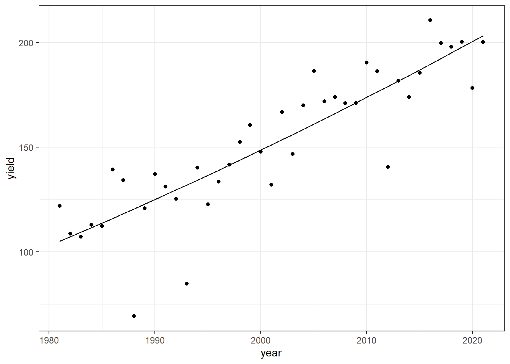
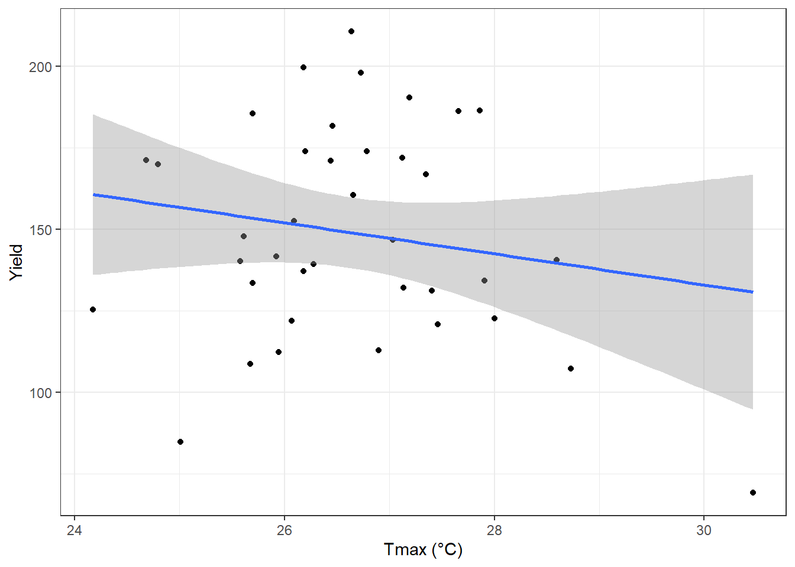
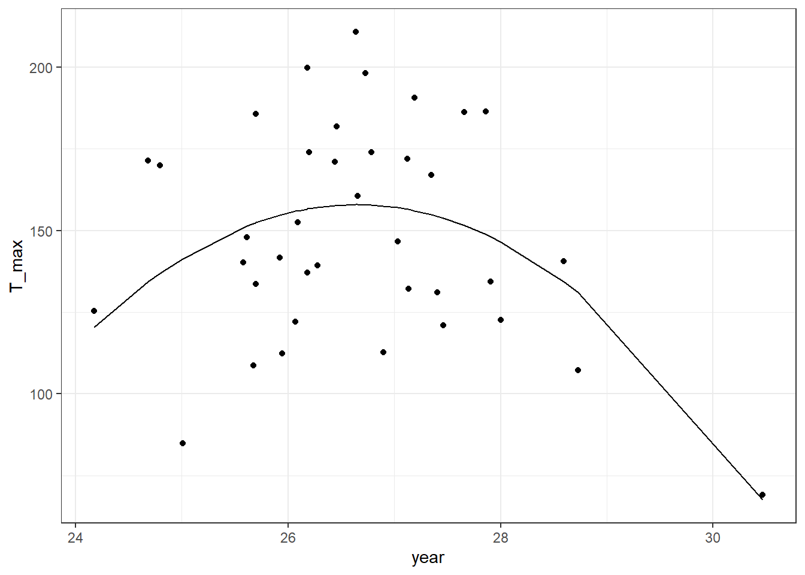
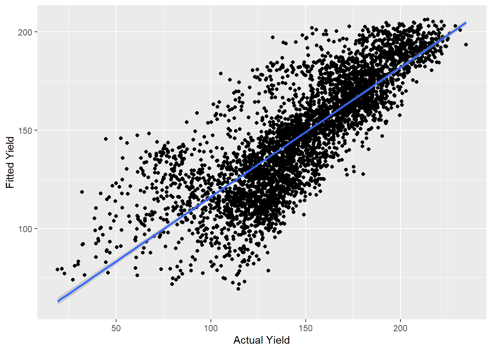

# Regressions


*Case Study: Iowa Corn Yields*

## Weather Data Analysis

### Load PRISM daily maximum temperatures


```r
# daily max temperature
# dimensions: counties x days x years
prism <- readMat("Data/Chapter_5/prismiowa.mat")

# look at county #1
t_1981_c1 <- prism$tmaxdaily.iowa[1,,1]
t_1981_c1[366]
```

```
## [1] NaN
```

```r
plot(1:366, t_1981_c1, type = "l")
```


```r
ggplot() +
  geom_line(mapping = aes(x=1:366, y = t_1981_c1)) +
  theme_bw() +
  xlab("day of year") +
  ylab("daily maximum temperature (°C)") +
  ggtitle("Daily Maximum Temperature, Iowa County #1")
```


```r
# assign dimension names to tmax matrix
dimnames(prism$tmaxdaily.iowa) <- list(prism$COUNTYFP, 1:366, prism$years)

# converted 3d matrix into a data frame
tmaxdf <- as.data.frame.table(prism$tmaxdaily.iowa)

# relabel the columns
colnames(tmaxdf) <- c("countyfp","doy","year","tmax")
tmaxdf <- tibble(tmaxdf)
```

## Temperature trends

### Summer temperature trends: Winneshiek County


```r
#convert to numeric
tmaxdf$doy <- as.numeric(tmaxdf$doy)
tmaxdf$year <- as.numeric(as.character(tmaxdf$year))

#filter by summer
winnesummer <- tmaxdf %>%
  filter(countyfp==191 & doy >= 152 & doy <= 243) %>%
  group_by(year) %>%
  summarize(meantmax = mean(tmax))

#plot data
ggplot(winnesummer, mapping = aes(x = year, y = meantmax)) +
  geom_point() +
  theme_bw() +
  labs(x = "year", y = "Tmax (°C)") +
  geom_smooth(method = lm)
```


```r
#linear model
lm_summertmax <- lm(meantmax ~ year, winnesummer)
summary(lm_summertmax)
```

```
## 
## Call:
## lm(formula = meantmax ~ year, data = winnesummer)
## 
## Residuals:
##     Min      1Q  Median      3Q     Max 
## -2.5189 -0.7867 -0.0341  0.6859  3.7415 
## 
## Coefficients:
##             Estimate Std. Error t value Pr(>|t|)
## (Intercept) 41.57670   36.44848   1.141    0.262
## year        -0.00747    0.01823  -0.410    0.684
## 
## Residual standard error: 1.232 on 36 degrees of freedom
## Multiple R-squared:  0.004644,	Adjusted R-squared:  -0.02301 
## F-statistic: 0.168 on 1 and 36 DF,  p-value: 0.6844
```

### Winter Temperatures - Winneshiek County


```r
#filter by winter
winnewinter <- tmaxdf %>%
  filter(countyfp==191 & (doy <= 59 | doy >= 335) & !is.na(tmax)) %>%
  group_by(year) %>%
  summarize(meantmax = mean(tmax))

#plot data
ggplot(winnewinter, mapping = aes(x = year, y = meantmax)) +
  geom_point() +
  theme_bw() +
  labs(x = "year", y = "Tmax (°C)") +
  geom_smooth(method = lm)
```


```r
#linear model
lm_wintertmax <- lm(meantmax ~ year, winnewinter)
summary(lm_wintertmax)
```

## Multiple regression -- Quadratic time trend


```r
#create quadratic value
winnewinter$yearsq <- winnewinter$year^2

#quadratic model
lm_wintertmaxquad <- lm(meantmax ~ year + yearsq, winnewinter)
summary(lm_wintertmaxquad)
```

```
## 
## Call:
## lm(formula = meantmax ~ year + yearsq, data = winnewinter)
## 
## Residuals:
##     Min      1Q  Median      3Q     Max 
## -3.3539 -1.2985 -0.2813  1.4055  4.2620 
## 
## Coefficients:
##               Estimate Std. Error t value Pr(>|t|)
## (Intercept) -1.086e+04  1.238e+04  -0.877    0.386
## year         1.085e+01  1.239e+01   0.876    0.387
## yearsq      -2.710e-03  3.097e-03  -0.875    0.388
## 
## Residual standard error: 2.051 on 35 degrees of freedom
## Multiple R-squared:  0.02694,	Adjusted R-squared:  -0.02867 
## F-statistic: 0.4845 on 2 and 35 DF,  p-value: 0.6201
```

```r
winnewinter$fitted <- lm_wintertmaxquad$fitted.values

#plot data
ggplot(winnewinter) +
  geom_point(mapping = aes(x = year, y = meantmax)) +
  geom_line(mapping = aes(x = year, y = fitted)) +
  theme_bw() +
  labs(x = "year", y = "Tmax (°C)")
```


## Download NASS corn yield data


```r
# set our API key with NASS
nassqs_auth(key = "5B47588E-E354-32FE-A42C-2789B2935796 ")

# parameters to query on 
params <- list(commodity_desc = "CORN", util_practice_desc = "GRAIN", prodn_practice_desc = "ALL PRODUCTION PRACTICES", year__GE = 1981, state_alpha = "IA")

# download
cornyieldsall <- nassqs_yields(params)

cornyieldsall$county_ansi <- as.numeric(cornyieldsall$county_ansi)
cornyieldsall$yield <- as.numeric(cornyieldsall$Value)

# clean and filter this dataset
cornyields <- select(cornyieldsall, county_ansi, county_name, yield, year) %>%
  filter(!is.na(county_ansi) & !is.na(yield))
cornyields <- tibble(cornyields)
```


##  Fit and Plot Linear time trend - Winneshiek County, IA


```r
#filter data to Winneshiek county
winneyields <- cornyields %>%
  filter(county_name == 'WINNESHIEK')

#plot data
ggplot(winneyields, mapping = aes(x = year, y = yield)) +
  geom_point() +
  theme_bw() +
  labs(x = "year", y = "Tmax (°C)") +
  geom_smooth(method = lm)
```


```r
#linear model
lm_winnieyields <- lm(yield~ year, winneyields)
summary(lm_winnieyields)
```

```
## 
## Call:
## lm(formula = yield ~ year, data = winneyields)
## 
## Residuals:
##     Min      1Q  Median      3Q     Max 
## -51.163  -1.841   2.363   9.437  24.376 
## 
## Coefficients:
##              Estimate Std. Error t value Pr(>|t|)    
## (Intercept) -4763.290    448.286  -10.63 4.46e-13 ***
## year            2.457      0.224   10.96 1.77e-13 ***
## ---
## Signif. codes:  0 '***' 0.001 '**' 0.01 '*' 0.05 '.' 0.1 ' ' 1
## 
## Residual standard error: 16.97 on 39 degrees of freedom
## Multiple R-squared:  0.7551,	Adjusted R-squared:  0.7488 
## F-statistic: 120.2 on 1 and 39 DF,  p-value: 1.767e-13
```


The adjusted R-squared of 0.7488 shows there is a significant, but not ironclad, linear relationship between year and yield.

## Fit and Plot quadratic time trend - Winneshiek County, IA


```r
#create quadratic valye
winneyields$yearsq_yield <- (winneyields$year)^2

#fit quadratic model
lm_winneyields_quad <- lm(yield ~ year + yearsq_yield, winneyields)
summary(lm_winneyields_quad)
```

```
## 
## Call:
## lm(formula = yield ~ year + yearsq_yield, data = winneyields)
## 
## Residuals:
##     Min      1Q  Median      3Q     Max 
## -51.384  -3.115   1.388   9.743  25.324 
## 
## Coefficients:
##                Estimate Std. Error t value Pr(>|t|)
## (Intercept)   2.583e+04  8.580e+04   0.301    0.765
## year         -2.812e+01  8.576e+01  -0.328    0.745
## yearsq_yield  7.641e-03  2.143e-02   0.357    0.723
## 
## Residual standard error: 17.17 on 38 degrees of freedom
## Multiple R-squared:  0.7559,	Adjusted R-squared:  0.7431 
## F-statistic: 58.84 on 2 and 38 DF,  p-value: 2.311e-12
```

```r
winneyields$fitted <- lm_winneyields_quad$fitted.values

#plot model
ggplot(winneyields) +
  geom_point(mapping = aes(x = year, y = yield)) +
  geom_line(mapping = aes(x = year, y = winneyields$fitted)) +
  theme_bw() +
  labs(x = "year", y = "yield")
```




The adjusted R-squared of 0.743 shows there is a significant, but not ironclad, quadratic relationship between year and yield.


## Summer Temperature and yields for the Winneshiek County time series.


```r
summer_yields <- left_join(winnesummer, winneyields)

#Linear Trend
ggplot(summer_yields, mapping = aes(x = meantmax, y = yield)) +
  geom_point() +
  theme_bw() +
  labs(x = "Tmax (°C)", y = "Yield") +
  geom_smooth(method = lm)
```



```r
lm_summeryield <- lm(yield~ meantmax, summer_yields)
summary(lm_summeryield)
```

```
## 
## Call:
## lm(formula = yield ~ meantmax, data = summer_yields)
## 
## Residuals:
##    Min     1Q Median     3Q    Max 
## -71.96 -19.85  -3.19  24.64  61.72 
## 
## Coefficients:
##             Estimate Std. Error t value Pr(>|t|)  
## (Intercept)  275.876    118.335   2.331   0.0255 *
## meantmax      -4.763      4.438  -1.073   0.2902  
## ---
## Signif. codes:  0 '***' 0.001 '**' 0.01 '*' 0.05 '.' 0.1 ' ' 1
## 
## Residual standard error: 32.88 on 36 degrees of freedom
## Multiple R-squared:  0.03101,	Adjusted R-squared:  0.004098 
## F-statistic: 1.152 on 1 and 36 DF,  p-value: 0.2902
```

```r
#Quadratic Trend

summer_yields$tempsq_summer <-(summer_yields$meantmax)^2

lm_summeryields_quad <- lm(yield ~ meantmax + tempsq_summer, summer_yields)
summary(lm_summeryields_quad)
```

```
## 
## Call:
## lm(formula = yield ~ meantmax + tempsq_summer, data = summer_yields)
## 
## Residuals:
##     Min      1Q  Median      3Q     Max 
## -56.587 -22.262  -0.982  22.409  52.798 
## 
## Coefficients:
##                Estimate Std. Error t value Pr(>|t|)   
## (Intercept)   -4223.604   1446.639  -2.920  0.00609 **
## meantmax        328.918    107.068   3.072  0.00410 **
## tempsq_summer    -6.173      1.979  -3.119  0.00362 **
## ---
## Signif. codes:  0 '***' 0.001 '**' 0.01 '*' 0.05 '.' 0.1 ' ' 1
## 
## Residual standard error: 29.5 on 35 degrees of freedom
## Multiple R-squared:  0.2417,	Adjusted R-squared:  0.1984 
## F-statistic: 5.579 on 2 and 35 DF,  p-value: 0.007887
```

```r
summer_yields$fitted <- lm_summeryields_quad$fitted.values

ggplot(summer_yields) +
  geom_point(mapping = aes(x = meantmax, y = yield)) +
  geom_line(mapping = aes(x = meantmax, y = fitted)) +
  theme_bw() +
  labs(x = "year", y = "T_max")
```



The linear adjusted R-squared of 0.0041 indicates there is not a significant linear relationship between yield and average summer temperature. However, using a quadratic regression with T_max^2 increases the Adjusted r-squared to 0.1984, indicating a (relatively) more significant relationship between yield and average summer temperature.


## 2018 Cross-Section relationship between temperature and yield -- Winneshiek County


```r
#filter data

yields_18 <- cornyields %>%
  filter(year==2018) %>%
  group_by(county_name) %>%
  unique() %>%
  filter(!is.na(county_ansi))

summer_county_18 <- tmaxdf %>%
  group_by(countyfp) %>%
  filter(year==2018) %>%
  filter(doy >= 152 & doy <=243) %>%
  summarize(meatmax=mean(tmax)) %>%
  rename(county_ansi = "countyfp")

summer_county_18$county_ansi <- as.numeric(as.character(summer_county_18$county_ansi))

county_summer_yield <- left_join(yields_18,summer_county_18, by='county_ansi')
```


```r
#fitted values

county_summer_yield$tempsq_county_summer <-(county_summer_yield$meatmax)^2

lm_countysummeryields_quad <- lm(yield ~ meatmax + tempsq_county_summer, county_summer_yield)
summary(lm_summeryields_quad)
```

```
## 
## Call:
## lm(formula = yield ~ meantmax + tempsq_summer, data = summer_yields)
## 
## Residuals:
##     Min      1Q  Median      3Q     Max 
## -56.587 -22.262  -0.982  22.409  52.798 
## 
## Coefficients:
##                Estimate Std. Error t value Pr(>|t|)   
## (Intercept)   -4223.604   1446.639  -2.920  0.00609 **
## meantmax        328.918    107.068   3.072  0.00410 **
## tempsq_summer    -6.173      1.979  -3.119  0.00362 **
## ---
## Signif. codes:  0 '***' 0.001 '**' 0.01 '*' 0.05 '.' 0.1 ' ' 1
## 
## Residual standard error: 29.5 on 35 degrees of freedom
## Multiple R-squared:  0.2417,	Adjusted R-squared:  0.1984 
## F-statistic: 5.579 on 2 and 35 DF,  p-value: 0.007887
```

```r
county_summer_yield$fitted <- lm_countysummeryields_quad$fitted.values
```


```r
#construct plot
ggplot(county_summer_yield) +
  geom_point(mapping = aes(x = meatmax, y = yield)) +
  geom_line(mapping = aes(x = meatmax, y = fitted)) +
  theme_bw() +
  labs(x = "Tmax (°C)", y = "Corn Yield")
```


The adjusted R-squared of 0.1984 shows that a quadratic regression isn't terrible, but doesn't quite fit. Overall, both the regression and overall plot indicates that the highest yields take place around a t_max of 28.


## Panel Graphs for All Iowa Counties
  

```r
#group by counties
county_yield_panel <- cornyieldsall %>% 
  group_by(county_name) %>% 
  unique() %>% 
  filter(!is.na(county_ansi))

#filter by summer
county_summer_panel <- tmaxdf %>%
  group_by(countyfp) %>%
  filter(doy >= 152 & doy <= 243) %>%
  summarize(meantmax = mean(tmax)) %>% 
  rename(county_ansi = "countyfp")

#creating panel dataset
county_summer_panel$county_ansi <- as.numeric(as.character(county_summer_panel$county_ansi))
county_summeryield_panel <- left_join(county_yield_panel,county_summer_panel, by='county_ansi') 
county_summeryield_panel <- subset(county_summeryield_panel, select = c(county_ansi, yield, meantmax, year))
county_summeryield_panel$county_ansi <- as.factor(county_summeryield_panel$county_ansi)
county_summeryield_panel$meantmaxsq <- county_summeryield_panel$meantmax^2
lm_county_summeryield_panel <- lm(yield ~ county_ansi + meantmax + meantmaxsq + year, county_summeryield_panel)
summary(lm_county_summeryield_panel)
```

```
## 
## Call:
## lm(formula = yield ~ county_ansi + meantmax + meantmaxsq + year, 
##     data = county_summeryield_panel)
## 
## Residuals:
##      Min       1Q   Median       3Q      Max 
## -101.016   -9.576    3.141   14.498   52.720 
## 
## Coefficients: (2 not defined because of singularities)
##                  Estimate Std. Error t value Pr(>|t|)    
## (Intercept)    -4.447e+03  5.773e+01 -77.031  < 2e-16 ***
## county_ansi3   -4.038e+00  4.822e+00  -0.838 0.402346    
## county_ansi5    1.137e+01  4.762e+00   2.387 0.017012 *  
## county_ansi7   -1.875e+01  4.791e+00  -3.913 9.27e-05 ***
## county_ansi9    9.961e+00  4.762e+00   2.092 0.036510 *  
## county_ansi11   1.214e+01  4.762e+00   2.550 0.010815 *  
## county_ansi13   1.400e+01  4.762e+00   2.940 0.003305 ** 
## county_ansi15   1.794e+01  4.762e+00   3.767 0.000168 ***
## county_ansi17   1.907e+01  4.762e+00   4.006 6.30e-05 ***
## county_ansi19   1.618e+01  4.762e+00   3.398 0.000687 ***
## county_ansi21   1.527e+01  4.762e+00   3.207 0.001352 ** 
## county_ansi23   1.620e+01  4.762e+00   3.403 0.000674 ***
## county_ansi25   1.611e+01  4.762e+00   3.384 0.000721 ***
## county_ansi27   1.444e+01  4.762e+00   3.032 0.002443 ** 
## county_ansi29   7.471e+00  4.762e+00   1.569 0.116740    
## county_ansi31   1.950e+01  4.762e+00   4.095 4.30e-05 ***
## county_ansi33   1.259e+01  4.762e+00   2.643 0.008249 ** 
## county_ansi35   1.961e+01  4.791e+00   4.094 4.32e-05 ***
## county_ansi37   1.136e+01  4.762e+00   2.385 0.017131 *  
## county_ansi39  -2.391e+01  4.854e+00  -4.926 8.76e-07 ***
## county_ansi41   1.311e+01  4.762e+00   2.752 0.005948 ** 
## county_ansi43   1.667e+01  4.762e+00   3.502 0.000468 ***
## county_ansi45   1.564e+01  4.762e+00   3.285 0.001027 ** 
## county_ansi47   1.308e+01  4.762e+00   2.748 0.006032 ** 
## county_ansi49   1.140e+01  4.762e+00   2.394 0.016730 *  
## county_ansi51  -1.835e+01  4.791e+00  -3.829 0.000130 ***
## county_ansi53  -1.692e+01  4.854e+00  -3.485 0.000497 ***
## county_ansi55   1.784e+01  4.762e+00   3.746 0.000182 ***
## county_ansi57   9.205e+00  4.791e+00   1.921 0.054767 .  
## county_ansi59   9.586e+00  4.762e+00   2.013 0.044179 *  
## county_ansi61   1.847e+01  4.762e+00   3.879 0.000107 ***
## county_ansi63   1.505e+01  4.791e+00   3.141 0.001694 ** 
## county_ansi65   1.564e+01  4.762e+00   3.284 0.001031 ** 
## county_ansi67   1.292e+01  4.762e+00   2.713 0.006703 ** 
## county_ansi69   1.818e+01  4.762e+00   3.818 0.000137 ***
## county_ansi71   5.283e+00  4.791e+00   1.103 0.270241    
## county_ansi73   1.652e+01  4.762e+00   3.469 0.000528 ***
## county_ansi75   1.861e+01  4.762e+00   3.908 9.45e-05 ***
## county_ansi77   5.432e+00  4.762e+00   1.141 0.254046    
## county_ansi79   1.771e+01  4.791e+00   3.696 0.000222 ***
## county_ansi81   1.725e+01  4.762e+00   3.622 0.000296 ***
## county_ansi83   1.844e+01  4.762e+00   3.873 0.000109 ***
## county_ansi85   6.308e+00  4.822e+00   1.308 0.190871    
## county_ansi87   2.288e+00  4.762e+00   0.481 0.630897    
## county_ansi89   9.930e+00  4.762e+00   2.085 0.037110 *  
## county_ansi91   1.767e+01  4.762e+00   3.711 0.000210 ***
## county_ansi93   1.811e+01  4.791e+00   3.780 0.000159 ***
## county_ansi95   9.245e+00  4.791e+00   1.930 0.053723 .  
## county_ansi97   5.466e+00  4.762e+00   1.148 0.251074    
## county_ansi99   1.824e+01  4.791e+00   3.808 0.000142 ***
## county_ansi101 -5.980e+00  4.762e+00  -1.256 0.209229    
## county_ansi103  6.598e+00  4.791e+00   1.377 0.168575    
## county_ansi105  1.373e+01  4.791e+00   2.867 0.004168 ** 
## county_ansi107  1.115e+00  4.762e+00   0.234 0.814897    
## county_ansi109  1.977e+01  4.762e+00   4.152 3.37e-05 ***
## county_ansi111 -4.163e+00  4.762e+00  -0.874 0.382010    
## county_ansi113  1.244e+01  4.791e+00   2.597 0.009438 ** 
## county_ansi115  4.693e+00  4.762e+00   0.986 0.324418    
## county_ansi117 -2.157e+01  4.854e+00  -4.444 9.08e-06 ***
## county_ansi119  1.481e+01  4.762e+00   3.109 0.001890 ** 
## county_ansi121 -1.192e+00  4.762e+00  -0.250 0.802273    
## county_ansi123  8.393e+00  4.762e+00   1.763 0.078051 .  
## county_ansi125  2.008e+00  4.791e+00   0.419 0.675200    
## county_ansi127  2.113e+01  4.791e+00   4.410 1.06e-05 ***
## county_ansi129  5.207e+00  4.822e+00   1.080 0.280268    
## county_ansi131  1.599e+01  4.762e+00   3.358 0.000792 ***
## county_ansi133  2.612e-01  4.762e+00   0.055 0.956257    
## county_ansi135 -1.605e+01  4.791e+00  -3.350 0.000815 ***
## county_ansi137  4.193e+00  4.762e+00   0.881 0.378621    
## county_ansi139  8.454e+00  4.762e+00   1.775 0.075914 .  
## county_ansi141  2.138e+01  4.762e+00   4.489 7.36e-06 ***
## county_ansi143  1.623e+01  4.762e+00   3.409 0.000659 ***
## county_ansi145 -2.161e+00  4.762e+00  -0.454 0.650018    
## county_ansi147  1.421e+01  4.762e+00   2.985 0.002856 ** 
## county_ansi149  1.130e+01  4.791e+00   2.359 0.018392 *  
## county_ansi151  1.804e+01  4.791e+00   3.765 0.000169 ***
## county_ansi153  1.409e+01  4.762e+00   2.959 0.003104 ** 
## county_ansi155  1.127e+01  4.791e+00   2.353 0.018674 *  
## county_ansi157  1.190e+01  4.762e+00   2.499 0.012509 *  
## county_ansi159 -2.032e+01  4.791e+00  -4.242 2.27e-05 ***
## county_ansi161  1.610e+01  4.762e+00   3.382 0.000728 ***
## county_ansi163  1.999e+01  4.762e+00   4.199 2.74e-05 ***
## county_ansi165  1.242e+01  4.791e+00   2.592 0.009582 ** 
## county_ansi167  2.028e+01  4.762e+00   4.258 2.11e-05 ***
## county_ansi169  1.564e+01  4.762e+00   3.284 0.001033 ** 
## county_ansi171  1.459e+01  4.762e+00   3.065 0.002194 ** 
## county_ansi173 -1.492e+01  4.791e+00  -3.115 0.001853 ** 
## county_ansi175 -1.017e+01  4.791e+00  -2.122 0.033861 *  
## county_ansi177 -1.457e+01  4.762e+00  -3.060 0.002225 ** 
## county_ansi179 -5.617e+00  4.791e+00  -1.172 0.241117    
## county_ansi181 -2.341e+00  4.822e+00  -0.485 0.627358    
## county_ansi183  8.595e+00  4.791e+00   1.794 0.072894 .  
## county_ansi185 -2.081e+01  4.791e+00  -4.344 1.44e-05 ***
## county_ansi187  2.026e+01  4.762e+00   4.254 2.15e-05 ***
## county_ansi189  1.695e+01  4.762e+00   3.560 0.000375 ***
## county_ansi191  1.315e+01  4.762e+00   2.761 0.005792 ** 
## county_ansi193  6.556e+00  4.762e+00   1.377 0.168630    
## county_ansi195  1.511e+01  4.762e+00   3.174 0.001517 ** 
## county_ansi197  1.816e+01  4.762e+00   3.813 0.000139 ***
## meantmax               NA         NA      NA       NA    
## meantmaxsq             NA         NA      NA       NA    
## year            2.292e+00  2.881e-02  79.557  < 2e-16 ***
## ---
## Signif. codes:  0 '***' 0.001 '**' 0.01 '*' 0.05 '.' 0.1 ' ' 1
## 
## Residual standard error: 21.43 on 3915 degrees of freedom
## Multiple R-squared:  0.6579,	Adjusted R-squared:  0.6493 
## F-statistic: 76.05 on 99 and 3915 DF,  p-value: < 2.2e-16
```

```r
county_summeryield_panel$fitted <- lm_county_summeryield_panel$fitted.values

#graphing
ggplot(county_summeryield_panel) +
  geom_point(mapping = aes(x = yield, y = fitted)) +
  geom_smooth(mapping = aes(x = yield, y = fitted),method = lm) +
  labs(x = "Actual Yield", y = "Fitted Yield")
```




The fitted yield matches the actual yield; the adjusted r-squared of 0.65 and extremely low p-value indicate the yield is a decent fit. The significance of both temperature values to the fitted model has decreased, with N/A coefficients.

### Cross-Section Plot for Soybeans -- All Iowa Counties


```r
#get soybeans data
params_soy <- list(commodity_desc = "Soybeans", statisticcat_desc="YIELD", prodn_practice_desc = "ALL PRODUCTION PRACTICES", year__GE = 1981, state_alpha = "IA")

#create documents
soyyieldsall <- nassqs_yields(params_soy)

#setting values as numerics
soyyieldsall$county_ansi <- as.numeric(soyyieldsall$county_ansi)
soyyieldsall$yield <- as.numeric(soyyieldsall$Value)

#filter relevant values
soyyields <- select(soyyieldsall, county_ansi, county_name, yield, year) %>%
  filter(!is.na(county_ansi) & !is.na(yield))
soyyields <- tibble(soyyields)

#cross-section
soy_yields_18 <- soyyields %>%
  filter(year==2018) %>%
  group_by(county_name) %>%
  unique() %>%
  filter(!is.na(county_ansi))

summer_county_18 <- tmaxdf %>%
  group_by(countyfp) %>%
  filter(year==2018) %>%
  filter(doy >= 152 & doy <=243) %>%
  summarize(meatmax=mean(tmax)) %>%
  rename(county_ansi = "countyfp")

summer_county_18$county_ansi <- as.numeric(as.character(summer_county_18$county_ansi))

#join datasets
soy_county_summer_yield <- left_join(soy_yields_18,summer_county_18, by='county_ansi')

soy_county_summer_yield$tempsq_county_summer <-(soy_county_summer_yield$meatmax)^2
```

```r
#fit linear model
lm_soy_countysummeryields_quad <- lm(yield ~ meatmax + tempsq_county_summer, soy_county_summer_yield)
summary(lm_summeryields_quad)
```

```
## 
## Call:
## lm(formula = yield ~ meantmax + tempsq_summer, data = summer_yields)
## 
## Residuals:
##     Min      1Q  Median      3Q     Max 
## -56.587 -22.262  -0.982  22.409  52.798 
## 
## Coefficients:
##                Estimate Std. Error t value Pr(>|t|)   
## (Intercept)   -4223.604   1446.639  -2.920  0.00609 **
## meantmax        328.918    107.068   3.072  0.00410 **
## tempsq_summer    -6.173      1.979  -3.119  0.00362 **
## ---
## Signif. codes:  0 '***' 0.001 '**' 0.01 '*' 0.05 '.' 0.1 ' ' 1
## 
## Residual standard error: 29.5 on 35 degrees of freedom
## Multiple R-squared:  0.2417,	Adjusted R-squared:  0.1984 
## F-statistic: 5.579 on 2 and 35 DF,  p-value: 0.007887
```

```r
soy_county_summer_yield$fitted <- lm_soy_countysummeryields_quad$fitted.values
```

```r
#construct plot
ggplot(soy_county_summer_yield) +
  geom_point(mapping = aes(x = meatmax, y = yield)) +
  geom_line(mapping = aes(x = meatmax, y = fitted)) +
  theme_bw() +
  labs(x = "Tmax (°C)", y = "Soy Yield")
```


A county cross-section for soil yield and temperature shows a similar relationship to corn yield. The highest yields are around a T-max of 28, and can be reasonably modeled by a quadratic regression.
